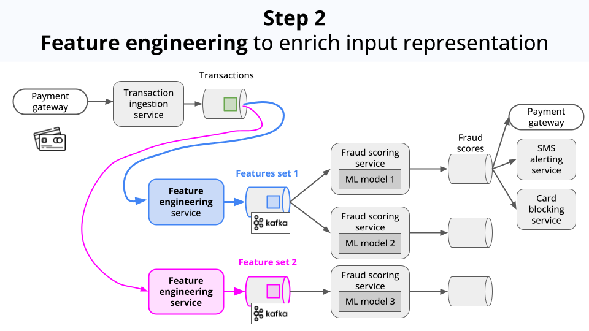

    <h1>Let's build an end-2-end real time ML system</h1>
    <h3><i>"If I have seen further it is by standing on the shoulders of <s>Giants</s> <a href="https://turboml.com/">TurboML</a>"</i></h3>
<h4>― Isaac Newton</h4>

### Table of contents

- [What's in this repository?](#whats-in-this-repository)
- [The problem](#the-problem)
- [The solution](#the-solution)
- [Hands-on example](#hands-on-example)
- [Next steps](#next-steps)

## What's in this repository?

In this repository you will find an end-2-end example of a real time ML system to predict credit card fraud.
Feel free to adjust it to your own use case

* crypto price prediction
* click-through rate prediction
* anomaly detection, or
* whatever problem that needs ML models to quickly adapt to changing patterns

leveraging the power of the [TurboML platform](https://turbo.ml).

Let's dive in!

## The problem

Every time your credit card is used online by someone (hopefully you), your card issuer has to check whether
the transaction is legitimate.

Behind the scenes, your credit card issuer (e.g. Visa, Mastercard, etc.) runs a modular real time ML system, that

1. Ingests the transaction data

    

2. Enriches the data with additional features (aka feature engineering).

    

3. Pipes these feature into a Machine Learning model. In this case, a classification model that outputs a fraud score. If the score
is above a certain threshold, the transaction is flagged as a fraud.

    

4. Serves these scores and flags to downstream services, so they can act accordingly, for example:
    - Block the transaction
    - Ban the card
    - Send an SMS alert to the user
    
    

The system is modular, so different feature engineering logic and models can be applied for the same incoming data.
This way their internal Data Science teams can do things like:

- Experiment with different feature engineering logic
- Experiment with different model architectures
- Compare the performance of different models, for safe deployments.
- Monitor the model performance over time
- Retrain the model incrementally on new data, to quickly adapt to changing fraud patterns.

But the thing is, building the underlying platform that supports these workflows is no piece of cake.

It requires a lot of infrastructure to be setup and maintained, like:

- Real-time data processing with Spark/Flink/Quix Streams/Bytewax.
- Model

So the question is: how do you build a production-ready ML system, without having to hire 100 engineers?

Let me show you!

## The solution

We will build on top of Turbo ML, a real time ML platform that allows you to quickly
build production-ready ML systems.

The idea is simple (and brilliant).

We define the business logic in Python, including
- data sources
- feature engineering logic
- model training and evaluation metrics

and TurboML handles all the infrastructure and low-level details to bring this logic to life.

So you go from idea to production at light speed.

## Hands-on example
All the source code snipets in this section are from this repository.

### 0. Set up the development environment

We will use a devcontainer to encapsulate a reproducible development environment.

This [devcontainer](./devcontainer/devcontainer.json) is a Linux container based on an official Docker image built by the TurboML team,
that comes with the TurboML Python SDK pre-installed.

To use devcontainers, you will need:

- A code editor compatible with devcontainers, like [VSCode](https://code.visualstudio.com/) together with
the [Dev Containers extension](https://code.visualstudio.com/docs/remote/containers)
- [Docker](https://docs.docker.com/desktop/) to spin up Docker containers on your machine

Once you have these tools installed, you

- git clone this repository
- open this source code with VSCode
- run the command palette (Ctrl+Shift+P) and select `Dev Containers: Reopen in Container`

You are all set.

### 1. Set up the feature pipeline

### 2. Deploy an online model with incremental training

### 3. Generate live predictions

### 4. Model monitoring

### 5. Model comparion

## Next steps
You can build on top of this end-2-end example, by    

- improving the accuracy of the system with furter feature engineering and model tunning
- plugging in your own real time data source

